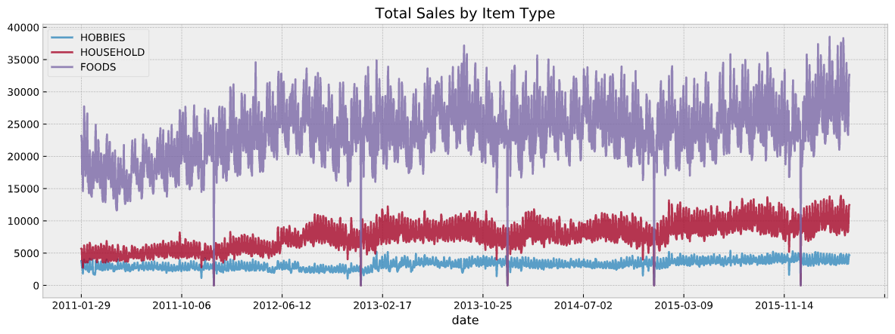

# M5 Forecasting
Estimate the unit sales of Walmart retail goods



## Performance
||Private Score|Public Score|  
|---|---|---|  
|trial 55| 0.68081 | 0.72698|  
|*trial 8* | *0.67948* | *0.74498*|  
|baseline [2]| 0.76218  | 0.51231 |

## Steps
1. Preprocess and split train set & valid set
```
time python process_train_valid.py
```

2. Hyperparameters Optimization
```
time python lightgbm_integration.py
```

3. Train Model using the Best Tuned Hyperparameters
```
time python train.py
```

4. Inference
```
time python inference.py
```


## Reference
- [1] [Time Series Forecasting-EDA, FE & Modelling📈](https://www.kaggle.com/anshuls235/time-series-forecasting-eda-fe-modelling)
- [2] [M5 Forecast v2 Python](https://www.kaggle.com/kneroma/m5-forecast-v2-python)
- [3] [Optuna: A hyperparameter optimization framework](https://github.com/optuna/optuna)
- [4] [LightGBM: A Highly Efficient Gradient Boosting Decision Tree](https://papers.nips.cc/paper/2017/file/6449f44a102fde848669bdd9eb6b76fa-Paper.pdf)